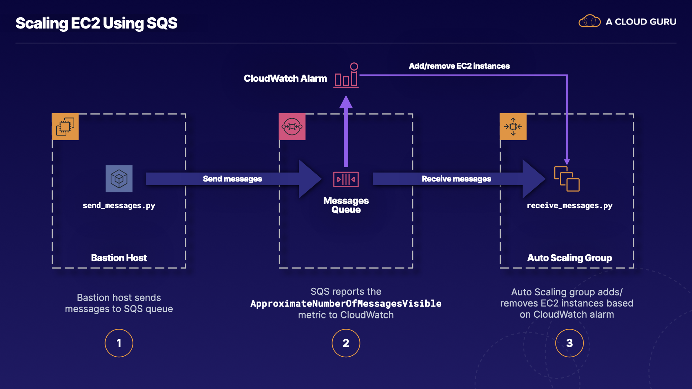

# Scaling EC2 Using SQS
## ABOUT THIS LAB

In this scenario, you're a solutions architect at an e-commerce firm. The company runs flash sales from time to time, and when there's a spike in orders, the fulfillment backend can struggle to meet demand. One way to solve the problem is to overprovision EC2 instances in the fulfillment system to provide headroom to process all the orders. However, this can be very costly, since you'll have unused capacity when the traffic subsides. What if there's a better way? Well, there is, and this is the problem you'll solve here. In this lab, you will learn to create Auto Scaling rules for EC2 based on the number of messages in an SQS queue.

## LEARNING OBJECTIVES
* Create CloudWatch Alarms
* Create Simple Scaling Policies
* Observe the Auto Scaling Group's Behavior in CloudWatch

## LAB DIAGRAM

## REQUIREMENTS
* Amazon EC2 Auto Scaling
* Amazon SQS
* Amazon CloudWatch
* Amazon CloudWatch Alarms
* Amazon Simple Scaling
* Amazon Simple Notification Service

## RESOURCES
* send_messages.py
* receive_messages.py
